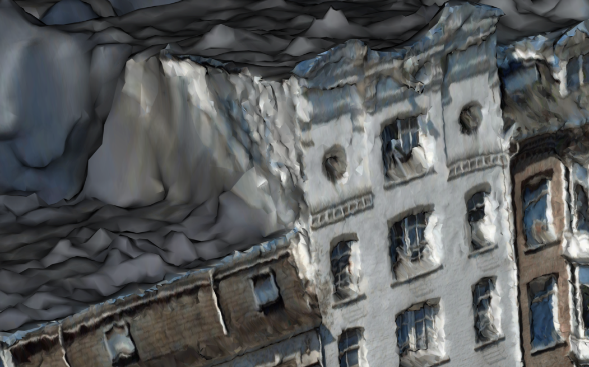
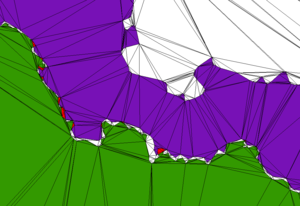
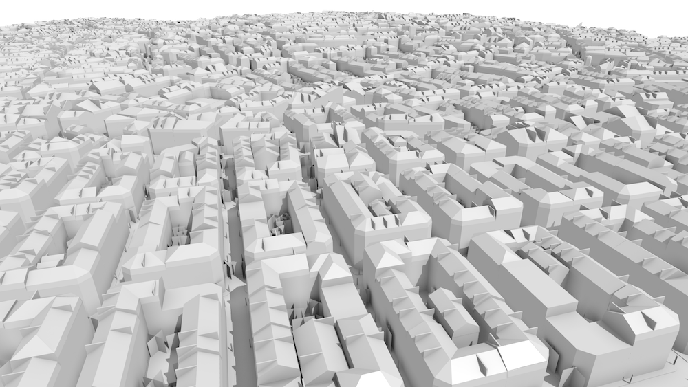
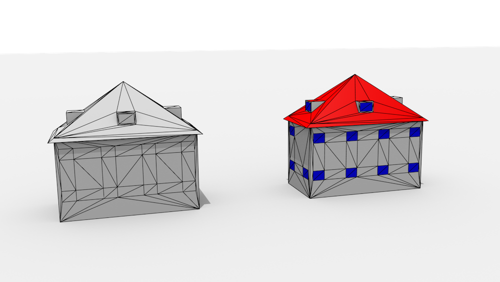

## "Straightening" and improvements of meshes of 3D city models obtained from image matching

<iframe src="https://player.vimeo.com/video/146221307?color=ff9933" width="640" height="360" frameborder="0" webkitallowfullscreen mozallowfullscreen allowfullscreen></iframe>

<a href="https://vimeo.com/146221307">3D - Amsterdam</a> from <a href="https://vimeo.com/cyclomedia">CycloMedia</a> on <a href="https://vimeo.com">Vimeo</a>.

{:width="500px"}

The video above of a part of Amsterdam was created automatically by [Cyclomedia](http://www.cyclomedia.com) from matching images taken from car driving around and of aerial photos.
From far away, the model looks admittedly great, but if you zoom in it is very "noisy", eg surfaces are not straight, and there are a lot of artefacts.
Different methods have been tried (eg [this one](https://hal.inria.fr/hal-00759261)), and here the goal is to see how methods you learned in the 3D modelling course (eg [RANSAC](https://en.wikipedia.org/wiki/RANSAC)) can be used.

We have a large area of Amsterdam already (in COLLADA format: textured triangles), so the project can start right away!

Notice that it's possible to do this project with a mix of software (FME, CloudCompare) and Python.

*Contact:* [Hugo Ledoux](http://tudelft.nl/hledoux) and [Abdoulaye Diakité](mailto:a.a.diakite@tudelft.nl)

- - -

## Automatic guesstimation of the level of detail of a 3D city model

{:width="800px"}

Every 3D city model has a level of detail, a measure that indicates its grade, usability and value. The LOD of a 3D city model is usually stored in the metadata, but it can also be evident from a quick inspection.

However, this is not always the case, and the number of non-homogeneous datasets with variable LOD is increasing. The goal of this project is to build and implement a method that is able to automatically deduce the level of detail of a 3D GIS dataset.

*Contact:* [Hugo Ledoux](http://tudelft.nl/hledoux) and [Filip Biljecki](http://tudelft.nl/biljecki)

- - -

## Generalisation of semantic 3D city models

Generalisation from a higher to a lower level of detail of a dataset is one of the key research topics in cartography (maps/scale) and computer graphics (3D models/simplification). 
In semantically enriched 3D city models, such as CityGML, the topic is not extensively researched because of some additional concepts, and due to differences such as selective generalisation (retaining the complexity of a part of a building such as the footprint while generalising only the roof). 
This research will investigate the generalisation of 3D city models, which will, beside the simplification of geometry, include generalisation of semantics and texture, and aggregation of city objects. Further, the student is expected to create a web interface which returns an generalised version of the uploaded CityGML dataset. 
The generalisation will be done according to the [new paradigm of levels of detail](http://3d.bk.tudelft.nl/biljecki/Random3Dcity.html) developed in our group.

*Contacts:* [Filip Biljecki](http://3d.bk.tudelft.nl/biljecki) and [Hugo Ledoux](http://tudelft.nl/hledoux)

- - - 

## Edge-matching with a constrained triangulation

While the edge-matching problem is usually tackled by snapping geometries within a certain threshold, in our [previous work](http://homepage.tudelft.nl/23t4p/pdfs/_11ostrava.pdf) we have shown that this solution is often not satisfactory and can be "dangerous". 
We have developed a novel edge-matching algorithm for polygons where vertices are not moved, instead gaps and overlaps between polygons are corrected by using a constrained triangulation as a supporting structure and assigning values to triangles. 
The aim of this MSc project is to extend that work to polylines, ie how can polygons and lines be snapped together robustly by using a triangulation as a base structure. 
The project involves first a literature review of the specifications for the edge-matching of features across countries (INSPIRE document), a translation of these into specific rules in a triangulation and a prototype implementation. 
The existing prototype (called [pprepair](https://github.com/tudelft3d/pprepair) that needs to be extended has been developed in C++, thus the knowledge of C++ or a strong desire to learn is necessary.

*Contact:* [Hugo Ledoux](http://tudelft.nl/hledoux)

- - - 

## Automatic thematic and semantic labelling of 3D city models

Many 3D city models are available as a soup of triangles, i.e. their geometry is not structured as in CityGML. This means that they do not contain semantics, i.e. the geometry of a building is not differentiated from a geometry of a road (above example), and the geometry within the same object (e.g. roof, windows and walls) have the same problem (see the image below, left with the desired result on the right). While such models may still be valuable in visualisation, their use for GIS purposes is hindered by the lack of semantics.

The goal of this thesis is to develop a reasoning system that would automatically infer the theme (semantics) of each geometric primitive, on two levels:

* City level (is it a tree, a building, or a road?)
* City object level (is the geometry a roof, a window, or a wall)?

The solution might involve pattern recognition techniques to aid the classification, hence it can be conducted in collaboration with the [Pattern Recognition Laboratory](http://prlab.tudelft.nl) at TU Delft.

*Contact:* [Filip Biljecki](http://3d.bk.tudelft.nl/biljecki), [David Tax](http://prlab.tudelft.nl/users/david-tax),  and [Hugo Ledoux](http://tudelft.nl/hledoux)

- - -

## Automatic construction of the 3D BAG datasets

{:width="800px"}

The aim is to develop a methodology to automatically construct the 3D BAG, using the BAG ([*Basisregistraties Adressen en Gebouwen*](https://bagviewer.kadaster.nl)), the BGT ([*Basisregistratie Grootschalige Topografie*](https://www.pdok.nl/nl/producten/pdok-downloads/download-basisregistratie-grootschalige-topografie)), and the AHN2 ([*Actueel Hoogtebestand Nederland*](http://www.ahn.nl/index.html)).
This dataset would contain---as shown in the figure above---the units within buildings (these are inferred from the BAG and the height of the building).

The project would be made in collaboration with the City of Den Haag, who have developed a prototype.
The student will have to improve their methodology, ensure that it is robust, and scale it for the whole country, if possible (or at least other municipalities).

The project requires programming in Python, the use of FME, and a desire to fight with a great amount of data.

*Contact:* [Hugo Ledoux](http://tudelft.nl/hledoux) and [Jantien Stoter](http://3d.bk.tudelft.nl/jstoter)

- - -

## Automatic construction of the 3D map of Amsterdam

  

  

  

The aim is to develop a methodology to automatically construct the 3D map of (parts of) Amsterdam so that it can be used by architects and others to "discover" hidden parts of the city.
The project would be in collaboration with people involved in the [Hidden Amsterdam Festival](http://stimuleringsfonds.nl/nl/actueel/toekenningen/hidden_amsterdam_festival/) and the [AMS institute](http://ams-amsterdam.com), and if successful would be used for the festival during the summer 2016.

Right now these 3D models are made manually, and the main objective of the project would be to investigate if these can be constructed automatically, and if yes with which datasets at what is the quality/accuracy of the 3D models?
The exterior of the buildings could be reconstructed with already available datasets (AHN, BAG, BGT, etc.), but the interior is also of interest.
Therefore, this topic is potentially suitable for 2-3 students working on different aspects.

*Contact:* [Hugo Ledoux](http://tudelft.nl/hledoux) or [Jantien Stoter](http://3d.bk.tudelft.nl/jstoter) or [Sisi Zlatanova](http://3d.bk.tudelft.nl/szlatanova)