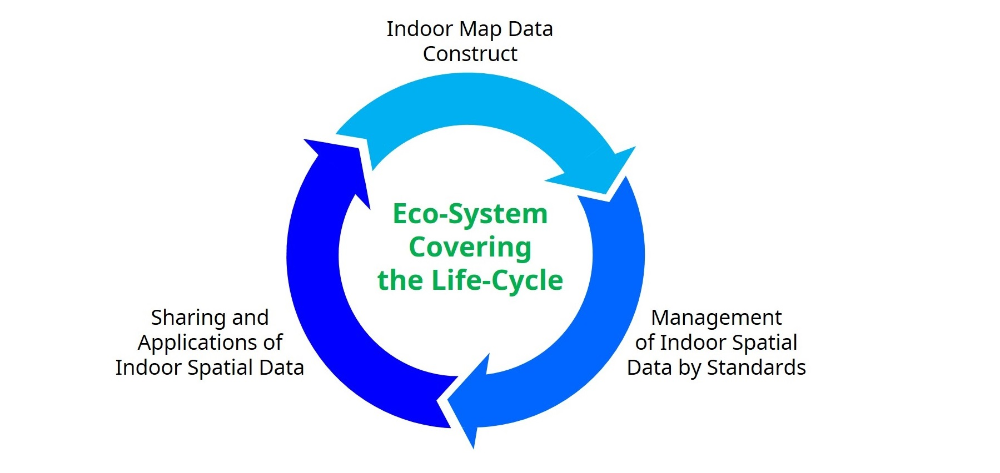

  

  

- - -

* Table of Content
{:toc}

- - -

## Summary

iNous (<strong>in</strong>door/<strong>ou</strong>tdoor <strong>s</strong>patial data services) is a large research project funded by the Korean government ([official webpage of the project](http://www.inous.net/).
The main objective is to develop an eco-systems of software for: 

  1. reconstructing indoor maps automatically
  2. managing these maps in an efficient way
  3. using these indoor maps in different applications

The focus of the project is on the [OGC standard IndoorGML](http://indoorgml.net/), but alternatives formats to represent the indoor of a building and its navigation graph will be sought.

{:width="500px"}

## What do we do?

We are responsible for 2 work packages:

1. the validation of IndoorGML files. This implies validating the geometry, topology, and general consistency of IndoorGML files. We will extend [val3dity](https://github.com/tudelft3d/val3dity) so that the rooms/cells in IndoorGML are validated, and so that the navigation graph is also validated.
2. the develop of a [JSON-based encoding](https://json.org/) for IndoorGML. [Our draft proposal for IndoorJSON](https://github.com/tudelft3d/indoorjson) is online, with some software to convert IndoorGML files.

- - - 

## Open-source software and standards

  1. [val3dity](https://github.com/tudelft3d/val3dity) (only branch 'develop' at this moment)
  2. [IndoorJSON](https://github.com/tudelft3d/indoorjson)

- - - 

## Team

     

